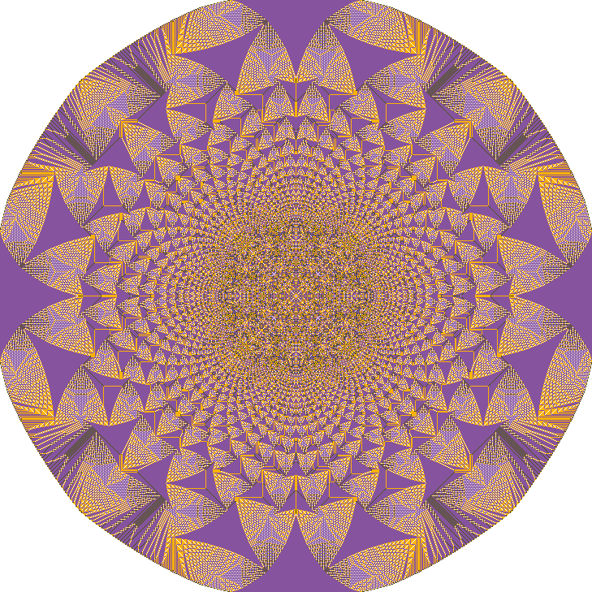

# Abelian Sandpile Model Simulator

A high-performance C++ implementation of the [Abelian Sandpile Model](https://en.wikipedia.org/wiki/Abelian_sandpile_model) that visualizes grid stability through color-coded BMP images.

## Description

The package provides a command-line utility to simulate the evolution of a "sandpile" on a 2D grid. Starting from an initial distribution of grains, the system undergoes a series of "toppling" events: any cell with 4 or more grains distributes one grain to each of its four neighbors. This implementation features a dynamic grid that automatically expands as sand reaches the boundaries, ensuring no data is lost during the simulation.

**Features:**

* **Dynamic Grid Expansion**: The simulation field grows automatically if sand reaches the edge of the current boundaries.
* **Efficient Processing**: Utilizes a custom `Queue` system to track only unstable cells, avoiding unnecessary iterations over stable parts of the grid.
* **Memory Optimization**: Implemented without standard library containers (like `std::vector`), using custom memory management for maximum control.
* **BMP Visualization**: Generates 4-bit (16-color) BMP images to visualize the state of the sandpile at specified intervals.
* **Iterative Control**: Supports stopping based on either system stability or a predefined maximum iteration count.

## How it works

The simulator follows a structured pipeline from argument parsing to image generation:

1. **Argument Parsing**: The `Arguments` class processes command-line flags to set the input file, output directory, and simulation constraints.
2. **Initialization**:
* The `StartArray` class reads the initial state from a TSV file.
* Coordinates are normalized (shifted) to ensure the minimum $x$ and $y$ values start at $(0, 0)$.


3. **Simulation Loop**:
* The `Table` class manages the 2D grid.
* In each `Iteration()`, cells with $\geq 4$ grains are popped from the queue, their grains are redistributed, and any newly unstable neighbors are pushed to the queue for the next step.
* If sand hits a boundary, the `Resize()` method expands the internal `uint8_t**` array.


4. **Output**:
* The `Image` class generates BMP files where each pixel color represents a grain count ($0$ to $>3$).


## Project Structure

```text
/ (root directory)
├─ CMakeLists.txt           # Top-level CMake configuration
├─ LICENSE                  # Project license
├─ README.md                # Project documentation
├─ example.tsv              # Sample input file with initial sandpile data
├─ bin/
│  ├─ CMakeLists.txt
│  └─ main.cpp              # Entry point: handles the simulation loop
├─ docs/
│  └─ preview_image.bmp
└─ lib/
   ├─ CMakeLists.txt
   ├─ Arguments/            # CLI argument parsing logic
   │  ├─ CMakeLists.txt
   │  ├─ Arguments.cpp
   │  └─ Arguments.hpp
   ├─ Image/                # BMP format and image generation
   │  ├─ CMakeLists.txt
   │  ├─ Image.cpp
   │  └─ Image.hpp
   ├─ Queue/                # Coordinate management for unstable cells
   │  ├─ CMakeLists.txt
   │  ├─ Queue.cpp
   │  └─ Queue.hpp
   ├─ Table/                # Main simulation grid and logic
   │  ├─ CMakeLists.txt
   │  ├─ Table.cpp
   │  └─ Table.hpp
   └─ Tsv/                  # TSV input parsing and coordinate normalization
      ├─ CMakeLists.txt
      ├─ Tsv.cpp
      └─ Tsv.hpp
```

## Usage Examples

### Running the Simulation

The utility is controlled via command-line arguments. You must provide an input file and an output path. (see [example.tsv](example.tsv))

```bash
# Basic run: process until stable and save the final result
./sandpile -i=input.tsv

# Advanced run: limit to 1000 iterations and save a BMP every 100 steps
./sandpile --input=input.tsv --output=./snapshots/ --max-iter=1000 --freq=100
```

### Argument Reference

| Short | Long | Description |
| --- | --- | --- |
| `-i` | `--input` | Path to the input TSV file. |
| `-o` | `--output` | Directory where BMP files will be saved. |
| `-m` | `--max-iter` | Maximum number of iterations to perform. |
| `-f` | `--freq` | Frequency of snapshots (0 = final only). |

### Visualization Palette

The output BMP images use the following color mapping for grains in a cell:

* **0 grains**: White
* **1 grain**: Green
* **2 grains**: Yellow
* **3 grains**: Purple
* **>3 grains**: Black

You can change the value in [Image.hpp](lib/Image/Image.hpp)
